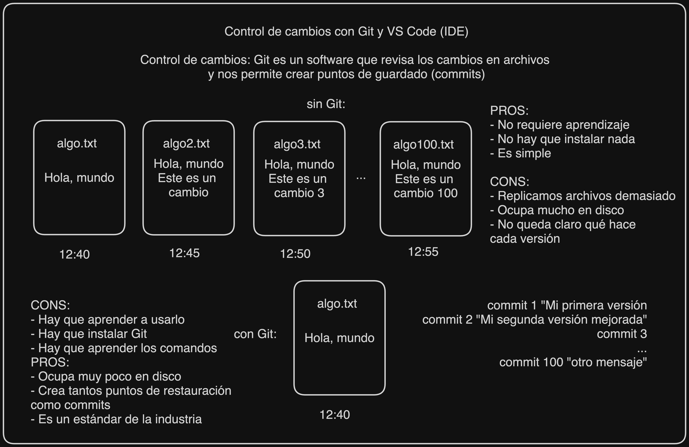
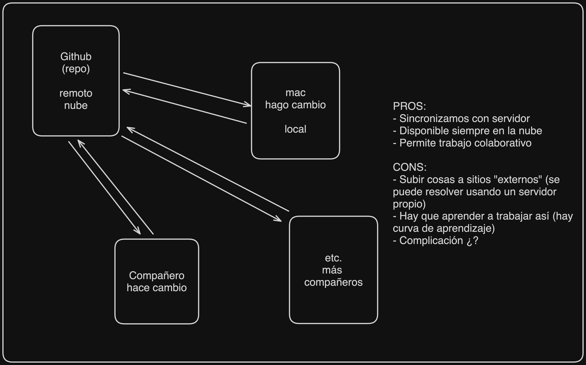
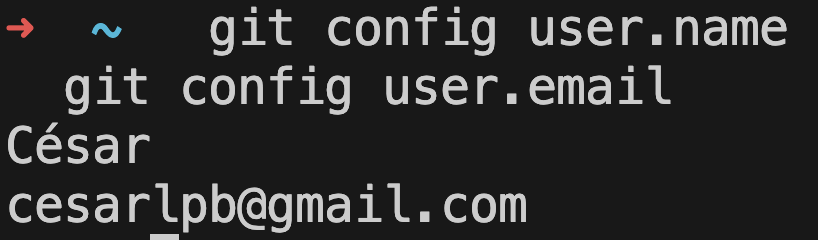
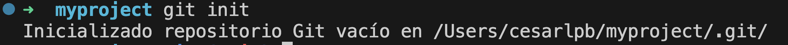
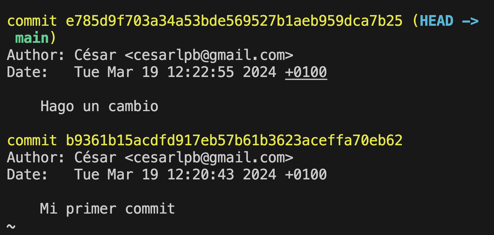
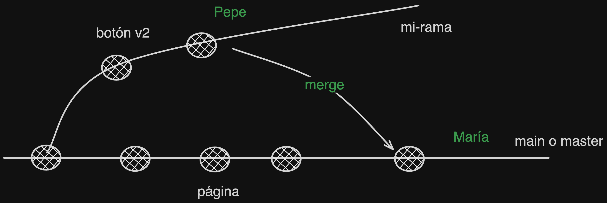
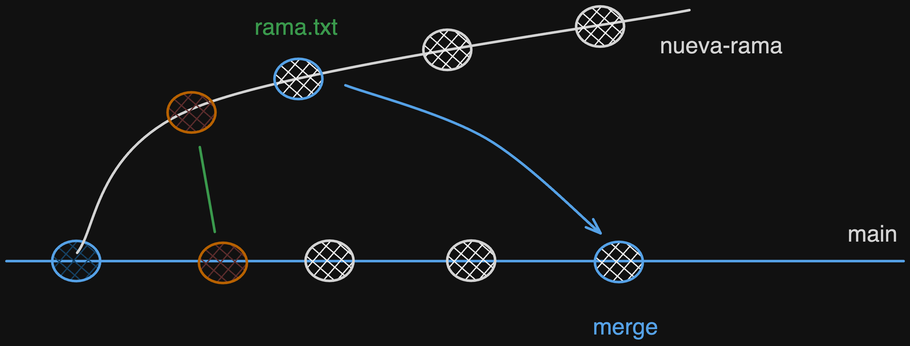
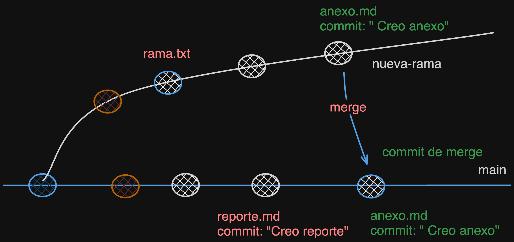

# IFCT0609
Repositorio de la formación IFCT0609

- Tutorial de Git en W3Schools: https://www.w3schools.com/git/default.asp

## Diagramas

Explicación de Git:


Explicación de Github:


## Comandos de Git

Configuración de usuario:

Primero, comprobamos que nos funciona Git.
```
  git
```

Configuramos el nombre de usuario:
```
  git config --global user.name "<Nombre Apellido>"
```

Configuramos el correo electrónico:
```
  git config --global user.email "<email@dominio.com>"
```

Verificamos los valores:
```
  git config --list
```

O miramos los valores por separado:
```
  git config user.name
  git config user.email
```
En mi caso, los valores son:



## Carpeta de trabajo

```
  mkdir myproject
  cd myproject
```

## Inicializar un repositorio

```
  git init
```

En mi caso, consigo esto:


### Crear commits en repositorio

Una vez hemos iniciado un repositorio, hacemos cualquier cambio y lo añadimos a staging con VS Code y `Confirmar`.

Vemos los cambios que hemos hecho con `git log`:



## Repaso

Lista de cosas a comprobar hasta este punto:

- [ ] Instalar Git y VS Code

**Nota:** Si estáis en Windows, fijaros que usais **CMD** o **Símbolo del sistema** como terminal. ❌ No uséis Powershell.

- [ ] Comprobar que funciona comando `git`
  - [ ] Comprobar version: `git --version` 

- [ ] Probar a clonar este repositorio con:
```
  git clone https://github.com/cesarlpb/IFCT0609.git
```
- [ ] Abrir la carpeta:
```
  cd IFCT0609
```
- [ ] Vemos el log:
```
  git log
```

## Git Branch

Ejemplo de trabajo con ramas en Git:


Ejemplo de branch `nueva-rama`:



## Git merge
Ejemplo de merge de la rama `nueva-rama` hacia la rama `main`:

